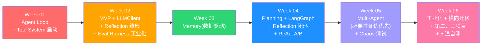

# Agent Learning — 学习路径总览

## 贯穿项目:三角度落地

不是一个 demo 反复刷,而是**主项目深度 + 横向迁移 + 抽象层通用性**三个维度同时验证。

| 项目 | 周次 | 角色 | 验证什么 |
|---|---|---|---|
| **ResearchAgent** | W1-W5 主线 | 主项目,完整能力栈 | Tool / Memory / Planning / Multi-Agent / Reflection 的端到端实现 |
| **CodeReviewAgent** | W6 周三-周四 | 横向迁移(2 天) | 基础设施可复用度 ≥ 80%,新增代码 < 500 行 |
| **DataAnalysisAgent** | W6 周五 | 90 分钟 Spike | 抽象层是否真正与领域无关 |

> [!warning] 一个 demo 反复刷不能证明你会做 Agent
> 第二、第三个项目**不能改 core/ planning/ agents/ evals/**,只能新增 prompts/ + 1-2 个工具。复用率必须用代码行数证明。

---

## 学习路径



---

## 周计划索引

| 周次 | 日期 | 阶段 | 核心能力 | 通过门槛 |
|---|---|---|---|---|
| [[Agent-Learning/Week-01_2026-04-20\|Week 01]] | 04-20 ~ 04-26 | 阶段0+1 | Agent Loop · Tool System 启动 | 工具调用闭环 + HITL + 黑名单 Flag |
| [[Agent-Learning/Week-02_2026-04-27\|Week 02]] | 04-27 ~ 05-03 | 阶段1 | LLMClient · Reflection 雏形 · Eval Harness 工业化 · MVP | **W2 baseline 落地**(token / 质量 / 速度三指标) |
| [[Agent-Learning/Week-03_2026-05-04\|Week 03]] | 05-04 ~ 05-10 | 阶段2 | Memory + 数据驱动必要性验证 | **跑 10 次实测 + 4 类使用率分析报告 + token 较 W2 -30%** |
| [[Agent-Learning/Week-04_2026-05-11\|Week 04]] | 05-11 ~ 05-17 | 阶段3 | Planning + LangGraph + Reflection 闭环 + ReAct A/B | **范式对比报告 + W4 质量超越 W3** |
| [[Agent-Learning/Week-05_2026-05-18\|Week 05]] | 05-18 ~ 05-24 | 阶段4上 | Multi-Agent(必要性证伪优先)+ Chaos | **必须显著超越 W4 single agent baseline,否则承认炫技** |
| [[Agent-Learning/Week-06_2026-05-25\|Week 06]] | 05-25 ~ 05-31 | 阶段4下 | 工业化收尾 + 第二/三项目 + 自测 | **CodeReviewAgent 复用率 ≥ 80% + DataAnalysisAgent spike 通过 + 5 道自测** |

---

## 系统演进

```
W2 MVP                单 Agent + 6 工具 + LLMClient + Reflection 雏形
                      + Eval Harness(LLM-as-Judge + Mock-First) + CI
W3 + Memory           四类记忆(用 10 次真实运行验证哪些真需要)
                      + structlog + 跨会话持久化
W4 + Planning         Plan-Act + Token Budget + 完整 Reflection 闭环
                      + ReAct vs Plan-Act 数据对比
W5 + Multi-Agent      先证伪必要性(决策门),通过才上 Coordinator
                      + Chaos 测试(3 类故障注入)
W6 工业化 + 多角度    CostTracker / Trace / 沙箱
                      + CodeReviewAgent(横向迁移 2 天)
                      + DataAnalysisAgent(spike 90 分钟)
                      + Eval 全集 + 5 道自测
```

---

## 五条贯穿主线

```
1. Provider 抽象        W2 LLMClient ──────────► W6 切换 provider 无感
                              │
                              └─ Token Logger ──► W6 CostTracker 聚合

2. Eval Harness         W2 起 5 case ─► W3 +3 ─► W4 +3 ─► W5 +3 ─► W6 全集 + 第二三项目 baseline
                        (含 LLM-as-Judge / golden answer / 难度分级)

3. Prompt 工程化        W4 prompts/ 目录 ─► W5 worker prompts ─► W6 CodeReview prompts
                        所有非平凡 Prompt 进 git,改 prompt = 改文件

4. Baseline-Driven      每周末跑 evals/baseline.py 写 baseline/wN.json
   Progression          下一周必须超越上周(token / 速度 / 质量任一显著改善)
                        否则当周复盘必须写"方向错在哪"

5. Mock-First Testing   80% eval 跑 mock(预录 LLM 响应,< 5s 全集)
                        20% 跑真 LLM(每周末验证 + 上线前)
                        开发循环不烧钱
```

---

## 验证机制(每周必跑)

```bash
# 开发循环(每天)
pytest evals/ --mock                    # < 5s, 不烧 token

# 周末验证
python evals/runner.py --real --judge   # 跑真 LLM + LLM-as-Judge 评分
python evals/baseline.py --week wN      # 写本周 baseline
python evals/baseline.py --compare wN-1 # 对比上周,任何下降标红

# 上线/Demo 前
python evals/chaos.py                   # W5 起,3 类故障注入测试
```

每周交付物里**必须包含 baseline json**,无 baseline = 周不通过。

---

## 技术栈

| 层 | 技术 | 引入时机 |
|---|---|---|
| LLM 调用 | Provider 直连(Anthropic / OpenAI 协议) | Week 01 |
| Provider 抽象 | 自研 `LLMClient` + Token Logger | Week 02 |
| Schema 验证 | Pydantic v2 | Week 01 |
| 配置 | `pydantic-settings`(model / temperature / timeout / 并发度) | Week 02 |
| 依赖注入 | 构造函数注入(Tool / Worker 都接受 client 参数,可 mock) | Week 02 |
| Eval Harness | 自研 jsonl + runner + LLM-as-Judge + golden + Mock-First | Week 02 |
| 结构化日志 | `structlog`(session_id / step_id 串联) | Week 03 |
| Prompt 管理 | `prompts/` 目录 + 文件加载 + git | Week 04 |
| 状态机 | LangGraph(只用 StateGraph) | Week 04 |
| 搜索 | Tavily API | Week 01 |
| 存储 | 文件系统 + SQLite | Week 01/03 |
| 测试 | pytest + pytest-asyncio | Week 02 |
| CI | ruff + mypy + pre-commit | Week 02 |
| Observability | 自研 Tracer + LangSmith(可选) | Week 06 |

> [!warning] 全程禁止
> LangChain / AutoGen / CrewAI 整个学习期间不使用。LangGraph 仅 W4 起,且只用 StateGraph,**不引 LangGraph 的 Tool / Memory / Agent 抽象**。

---

## 核心设计原则

> [!quote] Permission-First
> 每个工具显式声明权限。`needs_permission()` 返回 `allow | deny | ask_user`。新增工具默认对 LLM 可见,危险工具用 `DISABLED_TOOLS` 黑名单显式关闭。

> [!quote] Memory-as-Index
> 记忆是检索系统,不是全量上下文。Index 始终加载(< 1000 tokens),Payload 按需读取。**记忆类型必须用真实运行数据证明必要性**,任一类 0 次写入要么砍要么改。

> [!quote] Reflect-Before-Replan
> Self-correction 分两层:**in-task critic**(LLM 自评输出质量,不达标在 task 内修正)和 **cross-task replan**(in-task 修正失败再上抛)。retry / replan / reflect 是三种不同机制,不能混。

> [!quote] Coordinator-Worker Pattern
> Multi-Agent 不是对等的。Coordinator 合成理解(不可委托),Worker 接收自包含 Prompt。**默认 Spawn**,Continue 仅在高上下文重叠时使用。**走 Multi-Agent 之前先证伪 single agent 不够用**。

> [!quote] Cost-as-First-Class-Concern
> Token Logger 在 W2 就埋点,而非事后追加。任何 LLM 调用都进 jsonl,W6 直接聚合。

> [!quote] Eval-Driven & Baseline-Tracked
> 任何 LLM 系统的回归靠 eval 集 + baseline 对比,不靠手敲场景。每周 baseline 写入 `evals/baseline/wN.json`,通过率下降必须解释。LLM-as-Judge 取代字符串包含。

> [!quote] Mock-First Development
> 80% 测试跑 mock(预录响应),开发循环 < 5s。真 LLM 验证只在周末与上线前。

> [!quote] Provider-Agnostic
> 业务代码不直接调 SDK,通过 `LLMClient` 调用。换 provider 只改一个文件。

> [!quote] Prove-Reuse-by-Second-Project
> 一个 demo 反复刷不能证明你会做 Agent。第二个项目(CodeReviewAgent)必须 ≥ 80% 复用,**真复用率用代码行数证明**。

---

## 最终能力画像(6 周后能做的事)

每条都给"如何自验证"的判定方式。

1. **30 分钟出新场景架构方案** — W6 自测题1 + 找朋友抛 3 个场景
2. **基于数据做选型决策** — 单 Agent vs Multi、ReAct vs Plan-Act、模型路由,**有数据**而非直觉(W4 周日 / W5 周一的报告)
3. **工业化基础设施七件套**:配置 / 日志 / DI / Mock / CI / Cost / Trace 都能独立搭起来,`pytest evals/ --mock` 不烧 token 跑全集
4. **区分 retry / replan / reflect 三种自纠** — W4 周三的 in-task vs cross-task 测试
5. **横向迁移 2 天搭起来** — W6 CodeReviewAgent 复用率 ≥ 80%,新增 < 500 行
6. **30 分钟内故障定位** — Token 超支 / 质量回归 / 死循环 三类(W6 题3)

---

## 参考资料

- [[agent_learn_guidance|原始路线图评估]]
- [Anthropic SDK 文档](https://docs.anthropic.com)
- [OpenAI Function Calling](https://platform.openai.com/docs/guides/function-calling)
- [LangGraph 文档](https://langchain-ai.github.io/langgraph/)
- [Tavily API](https://tavily.com)
- [structlog 文档](https://www.structlog.org/)
- [pydantic-settings](https://docs.pydantic.dev/latest/concepts/pydantic_settings/)
