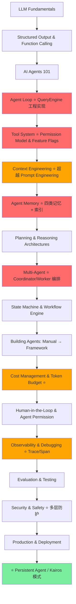

---
tags:
  - ai-agents
  - learning-path
  - evaluation
created: 2026-04-20
---

# AI Agents 学习路线评估 — roadmap.sh/ai-agents

## 一、路线图完整结构

路线图按以下顺序组织：

1. **Learn the Pre-requisites** — Basic Backend Development, Git/Terminal, REST API
2. **LLM Fundamentals** — Transformer Models, Tokenization, Context Windows, Generation Controls, Open/Closed Weight Models, Reasoning vs Standard Models, Embeddings & Vector Search, RAG Basics, Pricing
3. **AI Agents 101** — What are AI Agents, What are Tools, Agent Loop (Perception → Reason/Plan → Act → Observe/Reflect), Example Use Cases
4. **Prompt Engineering** — Writing Good Prompts, Iteration, Be Specific, Use Examples, Specify Format
5. **Tools / Actions** — Tool Definition, Name/Description, I/O Schema, Error Handling, Examples (Web Search, Code Execution, DB Queries, API Requests, Email/Slack, File System)
6. **Agent Memory** — Short-term vs Long-term, Within Prompt, Vector DB/SQL, Episodic vs Semantic, RAG & Vector DB, User Profile Storage, Summarization/Compression, Forgetting/Aging
7. **Agent Architectures** — ReAct, MCP (Hosts/Client/Servers, Creating MCP Servers, Deployment Modes), Chain of Thought, RAG Agent, Planner-Executor, DAG Agents, Tree-of-Thought
8. **Building Agents** — Manual from scratch (Direct LLM API, Agent Loop, Parsing output, Error/Rate-limit handling), Function Calling (OpenAI, Gemini, Anthropic), Assistant API, Frameworks (LangChain, LlamaIndex, Haystack, AutoGen, CrewAI, Smol Depot, LangGraph)
9. **Evaluation & Testing** — Metrics, Unit Testing for Tools, Integration Testing for Flows, Human-in-the-Loop, LangSmith, Ragas, DeepEval, Structured Logging & Tracing, Observability (Helicone, LangFuse)
10. **Security & Ethics** — Prompt Injection/Jailbreaks, Tool Sandboxing, Data Privacy/PII, Bias & Toxicity Guardrails, Safety & Red Team Testing
11. **Multi-Agents & Advanced** — Self-critique Agents, Multi-Agent Systems

---

## 二、总体评价

**评分：7.5 / 10** — 这是一个不错的入门路线图，涵盖了 AI Agent 开发的核心知识体系，但存在多处缺失和顺序问题。

### ✅ 做得好的地方

1. **Agent Loop 四阶段模型**清晰（Perception → Reason/Plan → Act → Observe/Reflect）
2. **从 LLM 基础到 Agent 构建**的渐进式结构合理
3. **覆盖了 MCP（Model Context Protocol）**，这是 2025 年的重要新标准
4. **Security & Ethics** 单独成章，提示注入、沙箱化等都列到了
5. **Evaluation 单独成章**，LangSmith/Ragas/DeepEval 都是主流工具

---

## 三、缺失的关键内容

### 🔴 严重缺失

| 缺失内容 | 为什么重要 | 建议 |
|---|---|---|
| **Agent Planning 深度** | 只提了 Planner-Executor 模式，但没有覆盖 Plan-as-code、动态重规划（Replanning）、分层规划（Hierarchical Planning） | 补充 Planning 系统性内容 |
| **State Machine / Workflow Engine** | Agent 的执行核心是状态机，如 LangGraph 的 StateGraph、Temporal 等工作流引擎 | 在 Agent Architecture 中增加 |
| **Human-in-the-Loop (HITL) 运行时机制** | 不仅在 Evaluation 中需要，在 Agent 运行时也需要（审批节点、确认步骤、中断恢复） | 从 Evaluation 独立出来放到 Architecture |
| **Cost Management** | Agent 运行成本远高于单次 API 调用，没有预算控制、token 预算、成本优化 | 新增独立章节 |
| **Reliability & Resilience** | 没有覆盖 Agent 的重试策略、fallback 机制、circuit breaker、timeout 管理 | 新增章节 |
| **Streaming & Real-time** | Agent 与用户交互需要流式输出、中间状态展示、进度反馈 | 在 Building Agents 中增加 |

### 🟡 中等缺失

| 缺失内容 | 说明 |
|---|---|
| **Structured Output** | Agent 大量依赖 JSON Mode / Structured Output，这是工具调用的前提，路线图未强调 |
| **Context Engineering** | 2025 年的核心概念——如何组织 prompt 中的上下文（system prompt、few-shot、retrieval 结果的编排），比传统 Prompt Engineering 更重要 |
| **Agent Observability 深度** | 只列了 Helicone/LangFuse，没讲 Trace/Span 模型、LLM Call 链路追踪、Agent 执行流可视化 |
| **A2A (Agent-to-Agent) Protocol** | Google 2025 年提出的 Agent 间通信协议，与 MCP 互补，未提及 |
| **Tool Composition / Chaining** | 工具间的组合调用、并行调用、条件调用策略 |
| **Agent 身份与权限模型** | Agent 以什么身份操作？OAuth for Agents、权限衰减（Privilege De-escalation） |
| **Testing 深度** | 缺少 Agent 的回归测试、Golden Path 测试、Adversarial Testing、模拟测试环境（Mock LLM） |

### 🟢 轻微缺失

- **Agent UX**：如何设计 Agent 的用户界面（思考过程展示、确认对话框、Agent 品牌化）
- **Agent 版本管理**：Prompt 版本、Tool 版本、Agent 定义版本
- **On-device / Edge Agent**：本地部署 Agent 的特殊考量
- **Multimodal Agent**：视觉 Agent、语音 Agent 的特殊架构
- **Agentic RAG 深度**：路由 RAG、自适应 RAG、纠正 RAG（CRAG）等模式

---

## 四、顺序与结构问题

1. **Prompt Engineering 放在 Agent Loop 之后不够合理**
   - Agent 的核心是工具调用和循环决策，Prompt engineering 应该融入各环节而不是作为独立前置章节
   - 建议：将 Prompt Engineering 合并到 LLM Fundamentals，将 Context Engineering 放在 Agent Architecture 中

2. **MCP 放在 Architecture 里但不完整**
   - 只覆盖了基本概念，缺少实际集成模式（MCP Server 设计模式、错误处理、多 MCP Server 编排）

3. **Multi-Agent 放在最后太靠后**
   - Multi-Agent 是 Agent 开发的重要模式，不应仅作为"高级话题"。至少应该与 Agent Architecture 并列

4. **缺少"Agent Design Patterns"系统化梳理**
   - 当前各种模式（ReAct、CoT、Planner-Executor、DAG、ToT）散落着，缺少模式间的比较和选择指南

5. **Building Agents 缺少渐进式项目**
   - 列了框架但没有推荐的实践项目。应该有：简单聊天机器人 → 单工具 Agent → 多工具 Agent → RAG Agent → Multi-Agent 的项目递进

---

## 五、Claude Code 泄露源码的关键启示

> 2026年3月31日，Anthropic 的 Claude Code v2.1.88 因 npm 打包配置失误，意外泄露了 512,000+ 行 TypeScript 源码（1906 个文件）。这是首个完整的工业级 AI Agent 代码库公开暴露，为学习 Agent 架构提供了珍贵的参考。

### 5.1 核心架构：QueryEngine 驱动一切

Claude Code 的核心是一个 **QueryEngine**（46K 行），驱动整个 Agent Loop：

```
User Input → QueryEngine → Streaming API Call → Parse Response
                                                    ↓
                                         Tool Use Block? → Execute Tool → Feed Result Back → Loop
                                                    ↓
                                         Text Block? → Stream to User
```

**路线图启示**：路线图提到了 "Agent Loop"，但没有深入这个循环的工程实现。学习时应关注：
- **流式响应处理**：如何逐 token 解析 LLM 输出并立即响应
- **Tool Loop 机制**：检测 tool_use 块 → 执行 → 结果注入 → 再次调用 LLM，直到 LLM 不再请求工具
- **Token 预算管理**：QueryEngine 跟踪每次调用的 token 使用，有统一的成本会计系统
- **重试和限流**：API 错误、rate limit 的处理策略是工程核心

### 5.2 工具系统：40+ 工具的精细治理

泄露源码揭示了 **42 个 Tool**，分为多个层级：

| 类别 | 工具 | 说明 |
|---|---|---|
| **核心工具** | BashTool, FileReadTool, FileWriteTool, FileEditTool, GlobTool, GrepTool | 始终可用 |
| **Agent 工具** | AgentTool, SendMessageTool, TaskCreateTool, TaskGetTool, TaskListTool, TaskUpdateTool, TaskStopTool | 子 Agent 管理 |
| **交互工具** | AskUserQuestionTool, TodoWriteTool | Human-in-the-Loop |
| **MCP 工具** | MCPTool, ListMcpResourcesTool, ReadMcpResourceTool, McpAuthTool | MCP 集成 |
| **功能标记工具** | SleepTool (KAIROS), REPLTool (Ant-only), RemoteTriggerTool | 未发布功能 |
| **调度工具** | ScheduleCronTool, RemoteTriggerTool | 定时/远程触发 |

**关键设计模式**：
- **权限模型**：每个工具实现 `needsPermission()` 方法，返回 `allow` / `deny` / `askUser`
- **工具注册表**：`getTools()` 函数按 feature flag 动态加载，未启用的工具不会出现在 LLM 的工具列表中
- **工具 Schema**：使用 Zod 定义输入输出，自动生成 JSON Schema 给 LLM
- **Feature Flag 门控**：44 个 feature flag 控制工具可见性

**路线图启示**：路线图的 Tools/Actions 章节太浅。应补充：
- Tool Permission 模型（默认拒绝、上下文授权、审计日志）
- Tool Schema 设计最佳实践
- Feature Flag 作为安全/治理原语

### 5.3 多 Agent 协调：Coordinator 模式

泄露源码揭示了 **Coordinator Mode** — 一个主 Agent 编排多个 Worker Agent 的模式：

```
User → Coordinator (主 Agent)
          ├── Worker A (研究任务)
          ├── Worker B (实现任务)
          └── Worker C (验证任务)
```

**Coordinator 的核心系统 Prompt 揭示了关键设计原则**：

1. **任务分阶段**：Research（Workers 并行）→ Synthesis（Coordinator 合成）→ Implementation（Workers 执行）→ Verification（Workers 验证）
2. **并行性是超能力**：只读任务自由并行，写任务同文件集串行
3. **Worker 提示必须自包含**：Worker 看不到 Coordinator 的对话，每个 prompt 必须完整
4. **合成理解不可委托**：Coordinator 必须自己理解研究结果，再写具体实现规格给 Worker
5. **Continue vs Spawn 决策表**：高上下文重叠 → Continue；低重叠/验证 → Spawn Fresh

**路线图启示**：路线图的 Multi-Agent 只列了"Multi-Agent Systems"，完全缺少这些关键概念：
- Coordinator/Worker 编排模式
- Worker 提示工程（自包含、有目的声明、定义"完成"条件）
- 并发控制策略
- Continue vs Spawn 决策框架
- 任务通知协议（`<task-notification>` XML 格式）

### 5.4 记忆系统：四类记忆 + AutoDream

泄露源码中的 `memoryTypes.ts` 定义了精心设计的记忆分类：

| 类型 | 作用 | 保存时机 |
|---|---|---|
| **user** | 用户角色、偏好、知识 | 了解用户身份时 |
| **feedback** | 行为指导（纠正+确认） | 用户纠正或确认非显而易见的方法时 |
| **project** | 项目上下文、目标、约束 | 了解谁在做什么、为什么时 |
| **reference** | 外部系统指针 | 得知外部资源位置时 |

**关键设计决策**：
- **记忆不是全量存储**：只存不可从代码/项目状态推导的信息
- **三层作用域**：user（全局）、project（项目级）、local（本地，不入 VCS）
- **Memory Drift 处理**：明确告知 Agent 记忆可能过时，以当前观察为准
- **AutoDream 系统**：空闲时自动"做梦"——扫描对话、去重、修剪过时记忆、合成新记忆

**路线图启示**：路线图的 Agent Memory 只有 "Short-term vs Long-term"，"Episodic vs Semantic" 是学术分类。Claude Code 的实现展示了工业级方案：
- 记忆分类法（user/feedback/project/reference）
- 记忆索引 vs 记忆负载分离
- 验证后才提交记忆
- 按需检索而非全量注入
- 记忆老化/修剪策略

### 5.5 Kairos：持久化后台 Agent

泄露源码揭示了 **Kairos** 系统（未发布）— Agent 的下一个进化方向：

- **持久守护进程**：即使终端关闭也能后台运行
- **Tick 机制**：定期 `<tick>` 提示检查是否需要行动
- **PROACTIVE 标志**：主动向用户推送未请求但重要的信息
- **Sleep & Self-resume**：Agent 可以休眠并自动唤醒
- **跨会话持久记忆**：文件系统级记忆 + AutoDream 整理

**路线图启示**：路线图完全没有覆盖"持久化 Agent"概念。这是 Agent 的重要演进方向：
- 事件驱动 Agent（文件变更、CI 信号、Issue 更新作为输入）
- Agent 生命周期管理（调度、资源上限、kill switch）
- 连续安全检查（后台自主性增加风险，权限和速率限制必须更强）

### 5.6 成本追踪：Token 预算系统

`cost-tracker.ts` 揭示了精细的成本会计：

- 跟踪每个模型的 input/output/cache tokens
- 跟踪 API 持续时间（含/不含重试）
- 跟踪工具执行时间
- 跟踪代码行增删
- 按会话持久化成本状态
- 格式化成本展示给用户

**路线图启示**：路线图只在 LLM Fundamentals 提了 "Token Based Pricing"，完全没有 Agent 级别的成本管理。

### 5.7 安全与权限

泄露源码揭示的安全模式：

- **Undercover Mode**：`undercover.ts` 注入系统提示要求 Claude 隐藏身份（引发伦理争议）
- **多层权限**：工具级、命令级、文件路径级的权限检查
- **沙箱机制**：代码执行隔离环境
- **Feature Flag 作为安全开关**：可快速回滚危险功能
- **假工具/诱饵工具（Decoy Tools）**：在系统提示中声明但不实际执行的工具，用于检测模型蒸馏（anti-distillation traps）。如果竞品模型输出匹配这些假工具调用，说明其在蒸馏 Claude Code 的提示
- **挫败感检测（Frustration Detection）**：正则表达式检测用户是否表达不满，触发行为调整（更解释性语气或切换策略）
- **5 级权限模型**：每个工具的权限细分为 5 个级别，实现纵深防御

**路线图启示**：路线图的 Security 章节只有 5 个条目，实际生产级 Agent 安全远比这复杂。特别缺失的是反蒸馏、挫败感检测、5 级权限模型这些工程级安全机制。

### 5.8 System Prompt 的多层动态组装

泄露源码揭示了 System Prompt 不是静态文本，而是**动态多层组装**的：

| 层级 | 内容 | 来源 |
|---|---|---|
| 1. 基础身份 | Agent 的角色定义和行为指令 | `constants/prompts.ts` |
| 2. Undercover 指令 | 隐藏身份模式（条件激活） | `utils/undercover.ts` |
| 3. 工具定义 | 根据当前可用工具和权限动态生成 | `tools.ts` 注册表 |
| 4. 记忆上下文 | `.claude/` 目录中的记忆文件 | `memdir/` 模块 |
| 5. MCP 工具描述 | 已连接的 MCP Server 的工具定义 | 运行时发现 |
| 6. 模式特定指令 | Plan 模式、Coordinator 模式等条件注入 | 各模式模块 |

**路线图启示**：路线图把 "Prompt Engineering" 当作写好文本的技巧。实际上，生产级 Agent 的 System Prompt 是一个**程序化组装的协议**，不同上下文注入不同的层级。这就是 "Prompt-as-Protocol" 的核心含义。

### 5.9 自愈 QueryEngine 与错误处理

核心 Agent Loop 函数体长达 **3,167 行**，说明工程复杂度远超路线图的 "Agent Loop" 概念：

- **自动重试**：API 瞬时故障自动重试
- **提示重构**：模型输出格式错误时，系统重构提示并重试
- **优雅降级**：工具失败时回退到替代方案
- **错误上下文注入**：错误信息以结构化方式注入对话，帮助模型自我纠正
- **Prompt 缓存**：`prompt-caching-scope-2026-01-05` Feature Flag 揭示了缓存优化
- **Task 预算**：`task-budgets` Feature Flag 揭示了按子任务分配 Token 预算

**路线图启示**：路线图提到了 "Error Handling in Agent"，但只有 2 个字。实际上错误处理是 Agent 工程的核心难点之一。

---

## 六、基于 Claude Code 泄露源码的路线图增补

### 新增必学主题

| # | 新增主题 | 来源 | 优先级 |
|---|---|---|---|
| A | **QueryEngine / Agent Loop 工程实现** | QueryEngine.ts (46K行) | 🔴 高 |
| B | **Tool Permission Model** | Tool.ts (29K行) | 🔴 高 |
| C | **Coordinator/Worker 编排** | coordinatorMode.ts | 🔴 高 |
| D | **四类记忆系统 + 记忆索引** | memoryTypes.ts, agentMemory.ts | 🔴 高 |
| E | **Feature Flag 作为治理原语** | 44 feature flags | 🟡 中 |
| F | **Cost Tracking & Token 预算** | cost-tracker.ts | 🟡 中 |
| G | **Persistent Agent / Kairos 模式** | SleepTool, KAIROS flags | 🟡 中 |
| H | **Worker 提示工程** | coordinatorMode.ts 提示模板 | 🟡 中 |
| I | **AutoDream 记忆整理** | memoryScan.ts, AutoDream | 🟢 低 |
| J | **Agent 身份与 Ethical 考量** | undercover.ts | 🟢 低 |

### 改进后的学习路线



> 标 ⭐ 的为基于 Claude Code 泄露源码新增或强化的主题

### 各阶段重点调整

1. **LLM Fundamentals** ← 加入 Structured Output、Context Window 管理、Cache 机制
2. **AI Agents 101** ← 保持不变
3. **Agent Loop** ← **大幅扩展**：QueryEngine 工程实现、流式处理、Token 计数、重试限流
4. **Tool System** ← **大幅扩展**：Permission Model (allow/deny/askUser)、Feature Flag、Zod Schema
5. **Context Engineering** ← **提升为核心**：System Prompt 构造、动态上下文注入、记忆注入
6. **Agent Memory** ← **重写**：四类记忆分类法、记忆索引 vs 负载、AutoDream 整理、老化修剪
7. **Planning & Reasoning** ← 新章节：动态规划、分层规划、Replanning
8. **Multi-Agent** ← **大幅扩展**：Coordinator/Worker 编排、Worker 提示工程、并发控制、Continue vs Spawn 决策
9. **State Machine & Workflow** ← 新章节：LangGraph / StateGraph / Temporal
10. **Building Agents** ← 按项目递进，每个阶段有可交付物
11. **Cost Management** ← **新增章节**：Token 预算、每模型成本追踪、会话持久化
12. **HITL & Permission** ← 新章节
13. **Observability** ← 深化 Trace/Span 模型、OpenTelemetry 集成
14. **Evaluation** ← 增加 Agent 专项测试方法
15. **Security** ← 增加 Agent 身份/权限模型、Undercover 伦理讨论
16. **Production** ← 新章节
17. **Persistent Agent** ← **新增章节**：Kairos 模式、事件驱动、生命周期管理

---

## 七、结论

roadmap.sh/ai-agents 是一个**合格的入门参考**，但不足以作为完整的学习路线。结合 Claude Code 泄露源码的分析，我们发现工业级 Agent 系统比路线图展示的要复杂得多：

### 路线图 vs 工业级实现的差距

| 维度 | 路线图覆盖 | Claude Code 揭示的工业级实现 |
|---|---|---|
| Agent Loop | 概念性四阶段 | 46K 行 QueryEngine：流式处理、工具循环、重试、Token 计数 |
| 工具系统 | 6 类工具例子 | 42 个工具 + 权限模型 + Feature Flag + Schema 验证 |
| 记忆 | Short vs Long term | 4 类记忆 + 索引 + AutoDream + 老化修剪 + 作用域 |
| 多 Agent | "Multi-Agent Systems" | 完整的 Coordinator 模式 + Worker 提示工程 + 并发控制 |
| 成本 | Token Based Pricing | 完整的 Token 预算系统 + 按模型追踪 + 持久化 |
| 安全 | 5 个条目 | 多层权限 + 沙箱 + Feature Flag 治理 + 身份管理 |
| 持久化 | 无 | Kairos 系统 + 后台守护进程 + 事件驱动 |

### 核心差距总结

路线图的最大问题是 **"概念够了，工程不够"** — 它教会你 Agent 是什么，但不教会你如何构建一个生产级 Agent。Claude Code 的源码填补了这个差距，展示了：

1. **Prompt-as-Protocol**：系统提示不是自由文本，而是结构化的行为协议
2. **Permission-First Design**：每个工具默认拒绝，显式授权
3. **Memory-as-Index**：记忆是检索系统，不是全量上下文
4. **Coordinator-Worker Pattern**：多 Agent 不是对等的，而是有明确的编排角色
5. **Feature-Flag-Governed**：新能力通过渐进式发布，不是一次性上线
6. **Cost-as-First-Class-Concern**：Token 预算和成本追踪是核心基础设施

建议以路线图为骨架，用 Claude Code 泄露源码作为"工程深度补充"，形成完整的学习计划。

---

## 参考来源

### 路线图
- [AI Agents Roadmap (roadmap.sh)](https://roadmap.sh/ai-agents)

### Claude Code 泄露源码
- [Claude Code — Leaked Source (GitHub)](https://github.com/codeaashu/claude-code)

### 泄露分析文章
- [Claude Code Source Code Leaked: What's Inside (The AI Corner)](https://www.the-ai-corner.com/p/claude-code-source-code-leaked-2026)
- [512,000 Lines of Code (APIYI)](https://help.apiyi.com/en/claude-code-source-leak-march-2026-impact-ai-agent-industry-en.html)
- [Technical Takeaways for LLM Developers (Blockchain Council)](https://www.blockchain-council.org/claude-ai/inside-claude-source-code-leak-technical-takeaways-llm-developers-prompt-engineers/)
- [A Look Inside Claude's Leaked AI Coding Agent (Varonis)](https://www.varonis.com/blog/claude-code-leak)
- [What the Claude Code Source Leak Reveals (Ars Technica)](https://arstechnica.com/ai/2026/04/heres-what-that-claude-code-source-leak-reveals-about-anthropics-plans/)
- [Undercover mode, decoy tools, and a 3,167-line function (liranbaba.dev)](https://liranbaba.dev/blog/claude-code-source-leak/)
- [7 Agent Architecture Lessons (Particula.tech)](https://particula.tech/blog/claude-code-source-leak-agent-architecture-lessons)
- [Fake tools, frustration regexes (alex000kim)](https://alex000kim.com/posts/2026-03-31-claude-code-source-leak/)
- [Kairos: Anthropic's Hidden Permanent Agent (Idlen)](https://www.idlen.io/news/claude-code-leak-source-code-kairos-permanent-agent-undercover-mode-anthropic)

